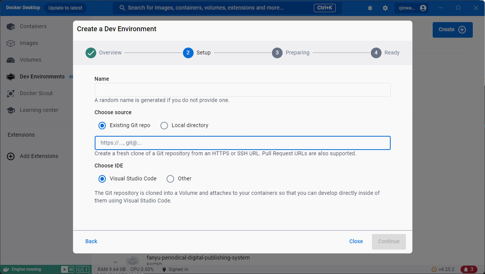

# Develop with docker container

## Installation Docker Desktop

Installation from [docker-desktop guide](https://www.docker.com/products/docker-desktop/)

## Configuration environment

Add file in the repository root named `compose-dev.yaml` with following content:

``` yaml
services:
  app:
    image: dev-environments:java-8
    security_opt:
      - seccomp:unconfined
    environment:
      - PUID=1000
      - PGID=1000
      - TZ=Etc/UTC
    ports:
      - 3000:3000
      - 3001:3001
    shm_size: "1gb"
    volumes:
    - type: bind
      source: /var/run/docker.sock
      target: /var/run/docker.sock

```

## Coding with docker

